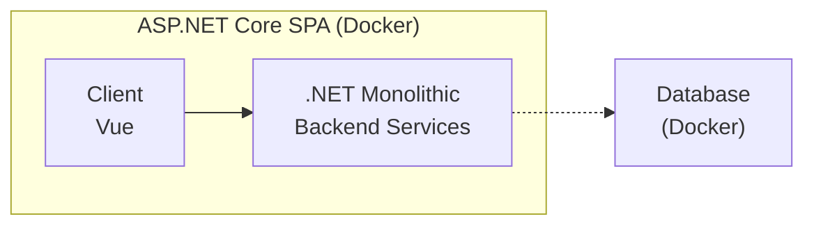
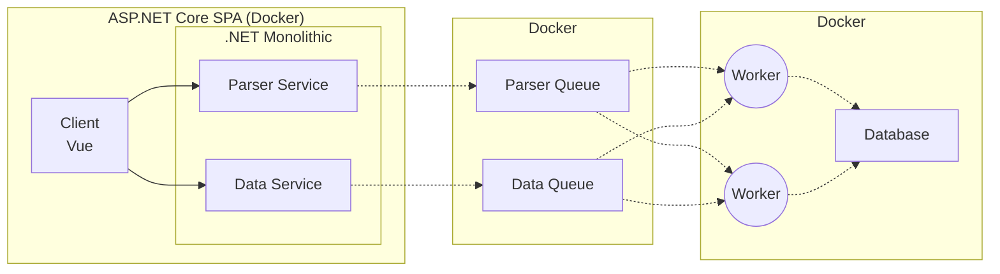

# Architecture Design

## MVP V1 (focused)

A single ASP.NET Core SPA deployment backed by a database — everything containerized with
Docker.

- **Client**: Vue SPA.
- **Backend**: .NET monolithic backend services.
- **Database**: runs in its own Docker container.

## Maybe final design

The monolith is split by responsibility into services, with queues and background workers
for the heavy parsing work.

- **Parser Service** handles CV ingestion/parsing requests; **Data Service** handles data
  access requests.
- Both enqueue work into **Parser Queue** and **Data Queue**.
- **Workers** consume from the queues and persist results to the **Database**.
- Each deployable unit remains containerized with Docker.
