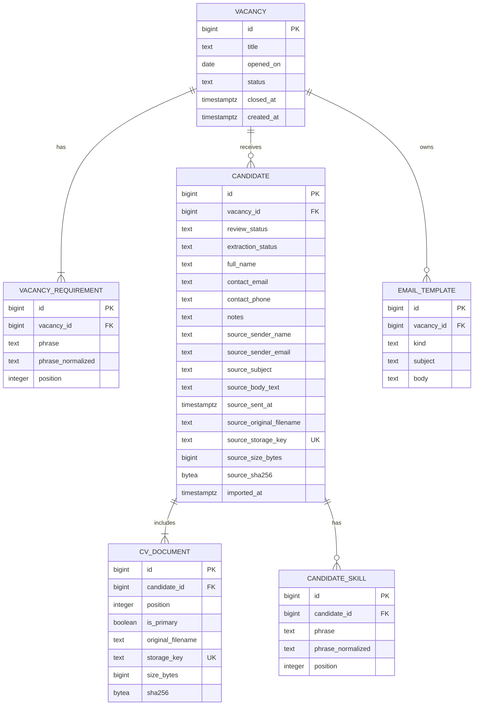

# MVP Database Design

Status: confirmed design for the Sorting CV MVP.

This document turns the [user stories](03-user-stories.md) and
[UI behavior](05-ui-sketches.md) into a PostgreSQL schema. It describes the complete MVP
model so that relationships remain coherent, but implementation starts with only `vacancy`
and `vacancy_requirement`.

The schema targets PostgreSQL 18, Compose and tests should use the same major version
before the first migration is merged.

## Design rules

- A candidate is one submission to one vacancy, not a reusable person profile.
- PostgreSQL stores relational data and private-file metadata. Original `.eml` and PDF bytes
  live in an application-managed private volume.
- Database constraints protect row-local facts and relationship cardinality. Application
  transactions protect workflow rules that span rows.
- Match and vacancy progress are derived from current data; neither is persisted.
- Statuses use `TEXT` with named `CHECK` constraints so they can evolve through migrations.
- Primary and foreign keys use `BIGINT GENERATED ALWAYS AS IDENTITY`.
- Binary hashes use the 32 raw SHA-256 bytes in `BYTEA`, not hexadecimal text.
- All timestamps are UTC `TIMESTAMPTZ`; the business opening date is `DATE`.
- There are no generic `updated_at` columns or audit-history tables in V1.

## Sharpened product decisions

| Earlier ambiguity | Confirmed model |
| --- | --- |
| Vacancy "date" | `opened_on`, separate from record creation time |
| Vacancy lifecycle | `open` or `closed`; closed data is read-only and can be reopened |
| Skill model | Ordered phrases scoped to a vacancy or candidate; no global catalogue |
| Candidate identity | One imported submission within one vacancy |
| Original email | Immutable `.eml` retained; parsed display fields may be absent |
| Multiple PDFs | All retained; one is primary, or temporarily none while HR chooses |
| Extraction failure | Candidate remains reviewable with nullable extracted details |
| Duplicate import | Exact source bytes are unique within a vacancy |
| Review lifecycle | `new`, `flagged`, `shortlisted`, or `rejected`; no `reviewed` state |
| Match status | Derived `matched requirements / total requirements` result |
| Bulk sending | Individual prepared messages; the app does not claim they were sent |
| Data retention | Closing retains data; deletion or purge is explicit |

## Entity relationship diagram



The diagram shows ownership, not every cardinality constraint. A vacancy owns at least one
requirement. A candidate owns at least one CV document. A vacancy can own at most one email
template of each kind. A candidate can temporarily have no primary CV only when multiple
PDFs require HR selection.

## PostgreSQL schema

This DDL is the physical design reference. EF Core migrations should produce equivalent
objects rather than running this file directly in production.

```sql
CREATE TABLE vacancy (
    id BIGINT GENERATED ALWAYS AS IDENTITY PRIMARY KEY,
    title TEXT NOT NULL,
    opened_on DATE NOT NULL,
    status TEXT NOT NULL DEFAULT 'open',
    closed_at TIMESTAMPTZ,
    created_at TIMESTAMPTZ NOT NULL DEFAULT now(),
    CONSTRAINT vacancy_title_check
        CHECK (char_length(btrim(title)) BETWEEN 1 AND 200),
    CONSTRAINT vacancy_status_check
        CHECK (status IN ('open', 'closed')),
    CONSTRAINT vacancy_closed_at_check
        CHECK (
            (status = 'open' AND closed_at IS NULL)
            OR (status = 'closed' AND closed_at IS NOT NULL)
        )
);

CREATE TABLE vacancy_requirement (
    id BIGINT GENERATED ALWAYS AS IDENTITY PRIMARY KEY,
    vacancy_id BIGINT NOT NULL,
    phrase TEXT NOT NULL,
    phrase_normalized TEXT GENERATED ALWAYS AS (lower(btrim(phrase))) STORED,
    position INTEGER NOT NULL,
    CONSTRAINT vacancy_requirement_vacancy_fk
        FOREIGN KEY (vacancy_id) REFERENCES vacancy (id) ON DELETE CASCADE,
    CONSTRAINT vacancy_requirement_phrase_check
        CHECK (char_length(btrim(phrase)) BETWEEN 1 AND 200),
    CONSTRAINT vacancy_requirement_position_check
        CHECK (position >= 1),
    CONSTRAINT vacancy_requirement_vacancy_position_key
        UNIQUE (vacancy_id, position) DEFERRABLE INITIALLY IMMEDIATE,
    CONSTRAINT vacancy_requirement_vacancy_phrase_key
        UNIQUE (vacancy_id, phrase_normalized)
);

CREATE TABLE candidate (
    id BIGINT GENERATED ALWAYS AS IDENTITY PRIMARY KEY,
    vacancy_id BIGINT NOT NULL,
    review_status TEXT NOT NULL DEFAULT 'new',
    extraction_status TEXT NOT NULL DEFAULT 'pending',
    full_name TEXT,
    contact_email TEXT,
    contact_phone TEXT,
    notes TEXT,
    source_sender_name TEXT,
    source_sender_email TEXT,
    source_subject TEXT,
    source_body_text TEXT,
    source_sent_at TIMESTAMPTZ,
    source_original_filename TEXT NOT NULL,
    source_storage_key TEXT NOT NULL,
    source_size_bytes BIGINT NOT NULL,
    source_sha256 BYTEA NOT NULL,
    imported_at TIMESTAMPTZ NOT NULL DEFAULT now(),
    CONSTRAINT candidate_vacancy_fk
        FOREIGN KEY (vacancy_id) REFERENCES vacancy (id) ON DELETE CASCADE,
    CONSTRAINT candidate_review_status_check
        CHECK (review_status IN ('new', 'flagged', 'shortlisted', 'rejected')),
    CONSTRAINT candidate_extraction_status_check
        CHECK (extraction_status IN ('pending', 'succeeded', 'failed')),
    CONSTRAINT candidate_full_name_check
        CHECK (full_name IS NULL OR char_length(btrim(full_name)) BETWEEN 1 AND 300),
    CONSTRAINT candidate_contact_email_check
        CHECK (contact_email IS NULL OR char_length(btrim(contact_email)) BETWEEN 1 AND 320),
    CONSTRAINT candidate_contact_phone_check
        CHECK (contact_phone IS NULL OR char_length(btrim(contact_phone)) BETWEEN 1 AND 100),
    CONSTRAINT candidate_source_sender_name_check
        CHECK (
            source_sender_name IS NULL
            OR char_length(btrim(source_sender_name)) BETWEEN 1 AND 300
        ),
    CONSTRAINT candidate_source_sender_email_check
        CHECK (
            source_sender_email IS NULL
            OR char_length(btrim(source_sender_email)) BETWEEN 1 AND 320
        ),
    CONSTRAINT candidate_source_original_filename_check
        CHECK (btrim(source_original_filename) <> ''),
    CONSTRAINT candidate_source_storage_key_check
        CHECK (btrim(source_storage_key) <> ''),
    CONSTRAINT candidate_source_size_bytes_check
        CHECK (source_size_bytes > 0),
    CONSTRAINT candidate_source_sha256_check
        CHECK (octet_length(source_sha256) = 32),
    CONSTRAINT candidate_source_storage_key_key
        UNIQUE (source_storage_key),
    CONSTRAINT candidate_vacancy_source_sha256_key
        UNIQUE (vacancy_id, source_sha256)
);

CREATE INDEX candidate_vacancy_imported_idx
    ON candidate (vacancy_id, imported_at, id);

CREATE TABLE cv_document (
    id BIGINT GENERATED ALWAYS AS IDENTITY PRIMARY KEY,
    candidate_id BIGINT NOT NULL,
    position INTEGER NOT NULL,
    is_primary BOOLEAN NOT NULL DEFAULT false,
    original_filename TEXT NOT NULL,
    storage_key TEXT NOT NULL,
    size_bytes BIGINT NOT NULL,
    sha256 BYTEA NOT NULL,
    CONSTRAINT cv_document_candidate_fk
        FOREIGN KEY (candidate_id) REFERENCES candidate (id) ON DELETE CASCADE,
    CONSTRAINT cv_document_position_check
        CHECK (position >= 1),
    CONSTRAINT cv_document_original_filename_check
        CHECK (btrim(original_filename) <> ''),
    CONSTRAINT cv_document_storage_key_check
        CHECK (btrim(storage_key) <> ''),
    CONSTRAINT cv_document_size_bytes_check
        CHECK (size_bytes > 0),
    CONSTRAINT cv_document_sha256_check
        CHECK (octet_length(sha256) = 32),
    CONSTRAINT cv_document_storage_key_key
        UNIQUE (storage_key),
    CONSTRAINT cv_document_candidate_position_key
        UNIQUE (candidate_id, position) DEFERRABLE INITIALLY IMMEDIATE
);

CREATE UNIQUE INDEX cv_document_candidate_primary_idx
    ON cv_document (candidate_id)
    WHERE is_primary;

CREATE TABLE candidate_skill (
    id BIGINT GENERATED ALWAYS AS IDENTITY PRIMARY KEY,
    candidate_id BIGINT NOT NULL,
    phrase TEXT NOT NULL,
    phrase_normalized TEXT GENERATED ALWAYS AS (lower(btrim(phrase))) STORED,
    position INTEGER NOT NULL,
    CONSTRAINT candidate_skill_candidate_fk
        FOREIGN KEY (candidate_id) REFERENCES candidate (id) ON DELETE CASCADE,
    CONSTRAINT candidate_skill_phrase_check
        CHECK (char_length(btrim(phrase)) BETWEEN 1 AND 200),
    CONSTRAINT candidate_skill_position_check
        CHECK (position >= 1),
    CONSTRAINT candidate_skill_candidate_position_key
        UNIQUE (candidate_id, position) DEFERRABLE INITIALLY IMMEDIATE,
    CONSTRAINT candidate_skill_candidate_phrase_key
        UNIQUE (candidate_id, phrase_normalized)
);

CREATE TABLE email_template (
    id BIGINT GENERATED ALWAYS AS IDENTITY PRIMARY KEY,
    vacancy_id BIGINT NOT NULL,
    kind TEXT NOT NULL,
    subject TEXT NOT NULL,
    body TEXT NOT NULL,
    CONSTRAINT email_template_vacancy_fk
        FOREIGN KEY (vacancy_id) REFERENCES vacancy (id) ON DELETE CASCADE,
    CONSTRAINT email_template_kind_check
        CHECK (kind IN ('shortlisted', 'rejected')),
    CONSTRAINT email_template_subject_check
        CHECK (char_length(btrim(subject)) BETWEEN 1 AND 998),
    CONSTRAINT email_template_body_check
        CHECK (btrim(body) <> ''),
    CONSTRAINT email_template_vacancy_kind_key
        UNIQUE (vacancy_id, kind)
);
```

### Normalized phrases

`phrase_normalized` makes comparison and owner-scoped uniqueness use the same rule:
`lower(btrim(phrase))`. It removes leading and trailing whitespace and ignores case. It does
not collapse internal whitespace, remove accents, apply stemming, or perform substring
matching.

The original phrase remains the display value. Reordering updates only `position`. Before
swapping positions, the application defers the applicable position constraint for the
transaction.

## Invariants

### Enforced by PostgreSQL

- All owned rows reference a real parent and use explicit `ON DELETE CASCADE`.
- Status values come from their defined sets.
- `closed_at` exists exactly when a vacancy is closed.
- Titles, phrases, template content, generated storage keys, and filenames are nonblank.
- Requirement and skill phrases are case-insensitively unique within their owner.
- Requirement, skill, and document positions are unique within their owner.
- Source emails cannot be imported twice into the same vacancy, including concurrent imports.
- Storage keys are unique within their file namespace, file sizes are positive, and SHA-256
  hashes are exactly 32 bytes.
- A candidate has at most one primary CV.
- A vacancy has at most one template for each supported kind.
- Every foreign-key access path is indexed. Composite unique constraints cover child tables
  whose foreign key is their first column; `candidate` has one explicit list-order index.

### Enforced by application transactions

- Vacancy creation includes at least one requirement and commits atomically.
- The final requirement cannot be removed.
- Mutating a vacancy or anything it owns first locks the vacancy row and verifies that it is
  open. This prevents close, import, and delete operations from racing.
- Closing warns about `new` or `flagged` candidates but is allowed; reopening enables changes.
- Ordinary vacancy deletion succeeds only when no candidates exist. Purge is the explicit
  operation that removes a populated vacancy.
- Candidate import validates one source email and at least one PDF before creating rows.
  Files in a batch import independently; failed files create no database records.
- One PDF becomes primary automatically. Multiple PDFs begin without a primary selection and
  extraction remains pending until HR selects one.
- Extraction can fail without removing the candidate. Re-extraction never overwrites corrected
  details or skills without explicit confirmation.
- Parsed missing email values remain `NULL`. Email and phone formats are validated gently in
  the application, not with database regular expressions.
- A template row is absent or complete. Preparing messages skips candidates without a contact
  email and reports them to HR.
- Database deletion and private-file deletion use staged writes and compensating cleanup because
  PostgreSQL cannot make a filesystem operation part of its transaction.

## Derived read models

### Vacancy progress

Only shortlisted and rejected candidates count as processed. A closed vacancy may remain below
100 percent.

```sql
SELECT
    v.id,
    count(c.id) FILTER (
        WHERE c.review_status IN ('shortlisted', 'rejected')
    ) AS processed_candidates,
    count(c.id) AS total_candidates
FROM vacancy AS v
LEFT JOIN candidate AS c ON c.vacancy_id = v.id
GROUP BY v.id;
```

### Candidate match

Match is recalculated from current requirements and candidate skills. This grouped query avoids
an N+1 query when listing a vacancy's candidates.

```sql
SELECT
    c.id,
    count(vr.id) FILTER (WHERE cs.id IS NOT NULL) AS matched_requirements,
    count(vr.id) AS total_requirements
FROM candidate AS c
LEFT JOIN vacancy_requirement AS vr ON vr.vacancy_id = c.vacancy_id
LEFT JOIN candidate_skill AS cs
    ON cs.candidate_id = c.id
    AND cs.phrase_normalized = vr.phrase_normalized
WHERE c.vacancy_id = $1
GROUP BY c.id, c.imported_at
ORDER BY c.imported_at, c.id
LIMIT $2;
```

Changing a requirement or candidate skill changes this result immediately. Review status remains
HR's independent decision.

## Index strategy

The schema adds only indexes required by uniqueness, foreign keys, and the known candidate-list
query. It deliberately omits standalone status indexes, vacancy ordering indexes, GIN indexes,
full-text search, and partitioning. At the expected scale of hundreds of candidates per vacancy,
those would add write cost without a demonstrated read benefit.

Add an index only after a production-shaped query and `EXPLAIN (ANALYZE, BUFFERS)` show a need.
For example, `(vacancy_id, review_status)` becomes reasonable if preparing status groups is
measurably slow; it is not needed preemptively.

## Private file storage

- Use a Docker-managed private volume, never a public static-files directory.
- Generate storage keys in the application. Do not derive paths from uploaded filenames or
  accept storage keys from clients.
- Use separate key namespaces for source emails and CV documents so uniqueness does not depend
  on cross-table checks.
- Preserve original filenames only as metadata for display.
- Treat source `.eml` and PDF bytes as immutable. Selecting a primary CV changes only relational
  metadata.
- Back up and restore PostgreSQL and the private volume as one recovery set.
- Serve files through the application after access checks. V1 has no user tables, so deployment
  must provide authentication and TLS before the application is reachable outside a trusted
  environment.

## Delivery phases

### Phase 1: Vacancy definition

Implement only `vacancy` and `vacancy_requirement`.

- Replace the prototype GUID/`CreatedOn` model with identity IDs, `opened_on`, lifecycle status,
  `closed_at`, and ordered requirements.
- Replace `EnsureCreated` with EF Core migrations. Existing prototype data need not be preserved.
- Create a vacancy and all requirements in one transaction.
- Support list, edit, close, reopen, and empty-vacancy deletion behavior.
- Return progress as `0/0`; do not add placeholder candidate tables.
- Cover external HTTP behavior for required fields, duplicate normalized requirements, preserved
  order, repeated title/date combinations, and closed-vacancy write rejection.

### Phase 2: Import foundation

Add `candidate` and `cv_document`, private-file storage, `.eml` parsing, per-file import results,
content-hash deduplication, and primary-CV selection. Do not add extraction logic yet.

### Phase 3: Extraction and review

Add `candidate_skill`, editable candidate details, extraction status, notes, review actions,
derived match, and derived vacancy progress.

### Phase 4: Contact preparation

Add `email_template`, copy-by-value reuse, the `candidate_name` and `vacancy_title` substitutions,
and one-at-a-time prepared messages. Do not record delivery or add SMTP.

## Deliberately absent from V1

- Shared person, talent, user, tenant, role, or permission tables
- A global skill catalogue, aliases, weights, fuzzy matching, or stored match scores
- A separate source-email table or rows for non-PDF attachments
- Failed-import, prepared-message, sent-email, audit-history, or soft-delete tables
- File blobs, uploaded template files, arbitrary JSONB metadata, or host filesystem paths
- Database triggers for closed-vacancy workflow rules
- Automatic retention, partitioning, queues, search infrastructure, or speculative indexes

These should be added only when a concrete workflow requires them. The first schema increment
remains two tables even though the complete ownership model is known.